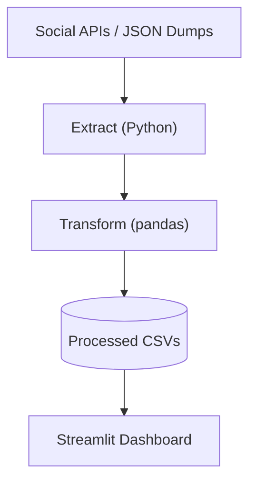
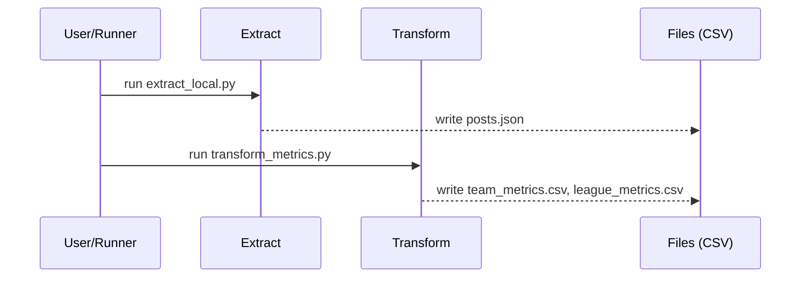

# 🏟️ Sports Social Media Analytics


Portfolio demo that ingests sample social posts (JSON), transforms them into engagement metrics (by team & league),
and renders a small Streamlit dashboard. Runnable extract/transform, **clean DE-style structure**, and diagrams.

---

## 🧱 Architecture (Mermaid)


## 🔁 Data Flow (Mermaid)


---

## ✅ What this shows
- 📥 Ingestion (stubbed extract) → 🧮 transformation → 📊 reporting
- 🧱 Organized repo for Data Engineering work
- ⚙️ Quick local run with minimal dependencies

---

## 🧰 Tech Stack
- 🐍 Python (pandas)
- 🗂️ JSON/CSV (local demo data)
- 🖥️ Streamlit (optional dashboard)

---

## 🚀 How to Run (Local)
```bash
# 1) install
pip install -r requirements.txt

# 2) generate raw + processed data
python src/extract/extract_local.py
python src/transform/transform_metrics.py

# 3) open the dashboard (optional)
streamlit run dashboards/app.py
```

---

## 📦 Outputs
- `data/processed/team_metrics.csv` — engagement by team
- `data/processed/league_metrics.csv` — engagement by league
- `data/processed/posts_enriched.csv` — posts with engagement column

---

## 📁 Project Structure
```
sports-social-media-analytics/
├─ src/
│  ├─ extract/extract_local.py
│  ├─ transform/transform_metrics.py
│  └─ load/ (optional)
├─ data/
│  ├─ raw/posts.json
│  └─ processed/
├─ dashboards/app.py
├─ notebooks/
├─ sql/
├─ docs/
├─ requirements.txt
└─ README.md
```

---

## 🔭 Status & Next
**Status:** Demo with sample data and runnable steps. 
**Next:** add lightweight CI, simple sentiment (e.g., VADER), and optional DB load.

